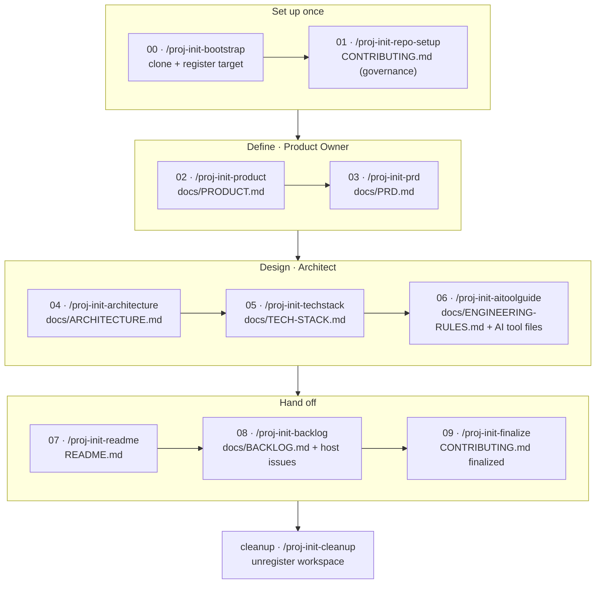

# Project Kickstart

> AI-driven playbook for project initiation — **10 steps to launch a clean, governed, build-ready code repository**

An AI-assisted starter kit to launch a new software project in a structured, reviewable way, before any code is written. The kit guides the team through ten steps, Step-00 to Step-09. In each step after Step-00, the AI assistant asks questions, drafts the step's documents (most from a predefined template), and submits them as a pull request. The Product Owner and/or Architect reviews it, and the documents become final only when the PR is approved and merged to `main`.

The kit acts as a **control plane**: it runs from its own repository and acts on a separate target repository. Step-00 clones the target and registers it locally, and every later step writes its output into that clone. The kit's guides, templates, and commands are never copied into the target.

When initiation is complete, the target contains:

| Document | Purpose |
| -------- | ------- |
| `CONTRIBUTING.md` | Governance and tooling rules |
| `docs/PRODUCT.md` | Product concept |
| `docs/PRD.md` | Product requirements |
| `docs/ARCHITECTURE.md` | System design |
| `docs/TECH-STACK.md` | Approved technologies |
| `docs/ENGINEERING-RULES.md` | Coding conventions, banned patterns, and testing rules |
| `CLAUDE.md` and/or `.github/copilot-instructions.md` | Instructions for the AI coding assistant in use |
| `README.md` | The project's entry point |
| `docs/BACKLOG.md` | Initial backlog |

The kit does not assume a technology stack; the stack is chosen in Step-05. It works with Claude Code and GitHub Copilot (agent mode). Other AI tools that can read and write files and run shell commands can follow the step guides directly.


## 🚀 Start Here

Before writing any code, register your target repo (Step-00), then run the Project Initiation process from this kit:

**→ [Project Initiation Guide](docs/guides/proj-init/_overview.md)**

Start with **Step-00**. It clones your target repository into a local folder and registers it in `.proj-init/state.json`, so every later step operates on that clone. It does not copy any kit files into the target, create product code, or choose a stack. Run `/proj-init-bootstrap` (or use [Step-00](docs/guides/proj-init/00-bootstrap.md) directly in another AI tool).

After Step-00, the process walks through Step-01 to Step-09. Step-02 through Step-08 each produce their own source-of-truth documents, finalized by a pull request; Step-09 strips the initiation-only material from `CONTRIBUTING.md` and hands off a permanent contribution core. Use the `/proj-init-*` commands as the primary interface. All adapters load the same shared runner, step registry, and step guides from `docs/guides/proj-init/` in this kit, and write the produced documents into the registered target repo.

Run exactly one step per session. Each step command checks status before it does anything else; run `/proj-init-doc-status` on its own any time.

## Prerequisites

- **Git** and a repository on a supported **Git host** — GitHub, Azure DevOps, Bitbucket, or GitLab. Step-01 configures branch governance to match your host, plan, and team size — see [Step-01](docs/guides/proj-init/01-repo-setup.md) for what's available on free vs. paid plans.
- Your host's **PR/MR CLI** — `gh` (GitHub), `az repos` (Azure DevOps), `glab` (GitLab) — or the host's web UI. Bitbucket has no official CLI; use the web UI or the third-party `atlassian-cli`. Without a CLI, push the branch and open the PR/MR manually.
- An AI coding assistant — Claude Code, GitHub Copilot Chat, or any tool your team or client uses. Use `/proj-init-*` as the primary interface; adapters point to the same shared workflow.

---

## Workflow at a Glance

The full visual walkthrough covers every step, the exact command, what it reads and writes, and who merges: **[proj-init-workflow.pdf](proj-init-workflow.pdf)** (source: [proj-init-workflow.html](proj-init-workflow.html)).



Steps 01–09 each end in a PR/MR that you merge. Merge to `main` = final.

## How It Works

Two one-time setup steps come first, then every document-producing step repeats the same loop — a document is **final only when its PR is merged to `main`**.

**Once, up front:**

- **Step-00 — Register the target repo**: run `/proj-init-bootstrap` or `node scripts/bootstrap-target-repo.mjs --target <folder> --url <git-url> --apply` to clone the target repo and register it in `.proj-init/state.json`.
- **Step-01 — Set up governance** (in the target): branch protection and the approval gate, before any document is written.

**Then, for each step from 02 to 09** (fresh session, run from this kit):

1. **Run the step's `/proj-init-*` command.** It resolves the target, checks status and preconditions, and waits for your `yes`. In any other AI tool, open `docs/guides/proj-init/_run-step.md`, the step entry in `docs/guides/proj-init/_steps.yml`, and the step guide in your AI chat.
2. **Answer its questions.** It creates `init/<step>` off `main` in the target, interviews you one question at a time, and revises the draft until you approve.
3. **Approve the push.** It commits, pushes the branch, and opens the PR/MR. If no host CLI is available, it gives you the URL to open it manually.
4. **Complete the self-review checklist, then merge.** Merge = finalized.
5. **Start the next step in a new session.** It fast-forwards `main` in the target before checking that the upstream documents are merged.

No draft files, no status flags: a doc on a branch is a draft, a doc on `main` is final.

## The Steps

| Step | Run | Produces |
| ---- | --- | -------- |
| 0 | `/proj-init-bootstrap` | cloned target repo + `.proj-init/state.json` registration |
| 1 | `/proj-init-repo-setup` | `CONTRIBUTING.md` (governance) + branch protection if plan supports it |
| 2 | `/proj-init-product` | `docs/PRODUCT.md` |
| 3 | `/proj-init-prd` | `docs/PRD.md` |
| 4 | `/proj-init-architecture` | `docs/ARCHITECTURE.md` |
| 5 | `/proj-init-techstack` | `docs/TECH-STACK.md` (+ `CONTRIBUTING.md` tooling layer) |
| 6 | `/proj-init-aitoolguide` | `docs/ENGINEERING-RULES.md` + one file per AI tool in use (e.g. `CLAUDE.md`, `.github/copilot-instructions.md`) |
| 7 | `/proj-init-readme` | the target's project `README.md` |
| 8 | `/proj-init-backlog` | `docs/BACKLOG.md` + host issues/work items |
| 9 | `/proj-init-finalize` | `CONTRIBUTING.md` with initiation-only governance removed + permanent core retained |
| — | `/proj-init-cleanup` | unregisters the workspace after Step-09 merges |

Step-01 through Step-09 write their output into the **registered target repo**, not this kit. Adapters are thin wrappers over the same workflow. The maintained workflow lives in `docs/guides/proj-init/_run-step.md`, step-specific metadata lives in `docs/guides/proj-init/_steps.yml`, and document rules live in the numbered step guides.

GitHub Copilot users can run the matching adapter prompts in `.github/prompts/proj-init-*.prompt.md` if preferred; they resolve to the same underlying steps.

Run `/proj-init-doc-status` at any time to see which steps are merged, which PR is open, and what's next.

See the [Project Initiation Guide](docs/guides/proj-init/_overview.md) for who owns each step, the PR gate, and the full rules.

## Repository Structure

```text
This kit (the control plane):
docs/guides/proj-init/           ← shared runner, utility workflows, step registry, and step-by-step guides
docs/guides/proj-init/templates/ ← output templates per generated doc + shared writing rules and references
scripts/check-template-drift.mjs ← guard: template headings must match each guide's section map
scripts/bootstrap-target-repo.mjs ← Step-00 script: clone the target repo and register it in .proj-init/state.json
.claude/commands/                ← thin /proj-init-* adapters + /proj-init-doc-update, /proj-init-doc-status, /proj-init-cleanup
.github/prompts/                 ← thin Copilot prompt adapters for /proj-init-* steps and doc utilities
.github/copilot-instructions.md  ← Copilot rule: use docs/guides/proj-init/ as source of truth
.proj-init/state.json            ← Step-00 workspace registration (gitignored, operator-local)
README.md                        ← this kit's entrypoint (the control-plane README)

Generated in the TARGET repo after running Step-01 through Step-09:
docs/PRODUCT.md                  ← product concept (Step-02)
docs/PRD.md                      ← requirements (Step-03)
docs/ARCHITECTURE.md             ← system design (Step-04)
docs/TECH-STACK.md               ← approved technologies (Step-05)
docs/ENGINEERING-RULES.md        ← coding conventions, banned patterns, testing rules (Step-06)
docs/BACKLOG.md                  ← initial backlog manifest + host issue IDs (Step-08)
CONTRIBUTING.md                  ← governance + tooling rules (Step-01 and Step-05; initiation-only material stripped in Step-09)
CLAUDE.md                        ← Claude Code instructions, if in use (Step-06)
.github/copilot-instructions.md  ← GitHub Copilot instructions, if in use (Step-06)
README.md                        ← the target's project entry point (Step-07)
```

## After Initiation

Step-07 (`/proj-init-readme`) writes **the target's own README** — describing the actual product, its setup, and how to run it. Step-08 (`/proj-init-backlog`) seeds the issue tracker. Step-09 (`/proj-init-finalize`) removes the initiation-only branching and self-review rules from `CONTRIBUTING.md`, leaving the permanent contribution core plus a stub the team fills in for the development phase. Once Step-09 is merged, run `/proj-init-cleanup` to unregister the workspace from this kit. The guides in `docs/guides/proj-init/` stay as the durable reference for the process, and this kit's own README is never overwritten.

### Keeping docs current

Run `/proj-init-doc-update <docname>` any time a source-of-truth document diverges from reality — a changed requirement, a new library, an architecture decision. It updates only the affected sections and opens a PR through the same review gate that originally finalized the document. See the [trigger table](docs/guides/proj-init/_overview.md#keeping-docs-current) for when to update which doc. To update a document in a project that has already finished initiation (or a different project while another initiation is active), pass an explicit clone: `/proj-init-doc-update <docname> --target <folder>` — no re-registration needed. `/proj-init-doc-status --target <folder>` works the same way.
